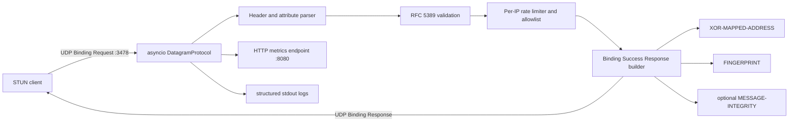

# Python RFC 5389 STUN Server

A production-oriented, stateless STUN Binding server implemented from scratch in Python 3.12. It does not use Coturn or any existing STUN server implementation.

## Architecture



## RFC 5389 Behavior

The server accepts STUN Binding Requests (`0x0001`) over UDP and returns Binding Success Responses (`0x0101`). It validates the 20-byte STUN header, the 32-bit aligned message length, the RFC 5389 magic cookie (`0x2112A442`), and the 96-bit transaction ID. The transaction ID from the request is copied unchanged into the response.

The response includes `XOR-MAPPED-ADDRESS` (`0x0020`), which contains the client IP and UDP source port as observed by the server. For IPv4 the port is XORed with the top 16 bits of the magic cookie, and the IPv4 address is XORed with the full magic cookie. IPv6 support is implemented with the magic cookie plus transaction ID mask.

The response includes `FINGERPRINT` (`0x8028`) by default. The fingerprint is CRC-32 over the STUN message with the header length already adjusted to include the fingerprint attribute, XORed with `0x5354554e`.

Optional short-term `MESSAGE-INTEGRITY` is supported with HMAC-SHA1. Set `STUN_INTEGRITY_PASSWORD` or `integrity_password` in config to require valid request integrity and include response integrity when the request supplies it.

## Project Layout

```text
stun-server/
├── app.py
├── config.py
├── requirements.txt
├── stun/
│   ├── server.py
│   ├── protocol.py
│   ├── parser.py
│   ├── response_builder.py
│   ├── attributes.py
│   ├── fingerprint.py
│   ├── integrity.py
│   ├── xor_address.py
│   └── constants.py
├── tests/
│   ├── test_parser.py
│   ├── test_xor.py
│   └── test_server.py
├── examples/
│   └── client.py
├── Dockerfile
├── docker-compose.yml
├── install.sh
├── systemd/
│   └── stun.service
└── README.md
```

## Configuration

Config is loaded from `/etc/stun-server/config.toml`, `./config.toml`, or a path passed with `--config`. Environment variables override file values.

```toml
[server]
host = "0.0.0.0"
port = 3478
metrics_host = "127.0.0.1"
metrics_port = 8080
log_level = "INFO"
rate_limit_per_minute = 600
allowlist = []
include_software = true
include_fingerprint = true
require_fingerprint = false
# integrity_password = "change-me"
```

Environment variables:

```text
STUN_HOST
STUN_PORT
STUN_METRICS_HOST
STUN_METRICS_PORT
STUN_LOG_LEVEL
STUN_RATE_LIMIT_PER_MINUTE
STUN_ALLOWLIST
STUN_INCLUDE_SOFTWARE
STUN_INCLUDE_FINGERPRINT
STUN_REQUIRE_FINGERPRINT
STUN_INTEGRITY_PASSWORD
```

## Run Locally

```bash
python3.12 -m venv .venv
. .venv/bin/activate
pip install -r requirements.txt
python app.py
```

Binding to UDP port 3478 may require root or `CAP_NET_BIND_SERVICE` on Linux.

## Ubuntu 24.04 Installation

```bash
sudo ./install.sh
sudo systemctl status stun.service
```

The installer creates `/opt/stun-server`, `/etc/stun-server/config.toml`, installs the systemd unit, opens UDP 3478 with UFW, enables auto-start, and starts the service.

## Docker

```bash
docker compose up -d --build
docker compose logs -f
```

## Metrics

Metrics are served as JSON over HTTP:

```bash
curl http://127.0.0.1:8080/metrics
```

Example output:

```json
{
  "active_ip_count": 1,
  "average_response_time_ms": 0.245,
  "invalid_packets": 0,
  "rate_limited": 0,
  "requests_received": 10,
  "responses_sent": 10
}
```

## Logging

Logs are written to stdout with timestamp, source IP, source port, transaction ID, request type, response time, and errors. Under systemd, read them with:

```bash
journalctl -u stun.service -f
```

## Tests

```bash
python -m pytest
```

The tests cover header parsing, message length validation, magic cookie rejection, transaction ID propagation, XOR-MAPPED-ADDRESS encoding, response generation, rate limiting, and the metrics endpoint.

## Validation

Run the bundled client:

```bash
PYTHONPATH=. python examples/client.py <SERVER_PUBLIC_IP>
```

Expected result:

```text
Observed public address: <your-client-public-ip>:<your-client-source-port>
```

After deployment, WebRTC-compatible clients can use:

```text
stun:<SERVER_PUBLIC_IP>:3478
```

## Browser WebRTC Testing

Open browser developer tools and run:

```javascript
const pc = new RTCPeerConnection({
  iceServers: [{ urls: "stun:<SERVER_PUBLIC_IP>:3478" }]
});
pc.createDataChannel("test");
pc.onicecandidate = event => {
  if (event.candidate) console.log(event.candidate.candidate);
};
pc.createOffer().then(offer => pc.setLocalDescription(offer));
```

You should see ICE host and server-reflexive candidates. A `srflx` candidate confirms the STUN Binding Response was accepted.

## Security Notes

This service is stateless by design, which keeps amplification and memory pressure low. It rejects malformed datagrams, invalid magic cookies, unsupported message types, non-aligned lengths, and allowlist failures. Per-IP sliding-window rate limiting provides basic flood protection. Put the metrics endpoint on localhost or behind trusted infrastructure.
